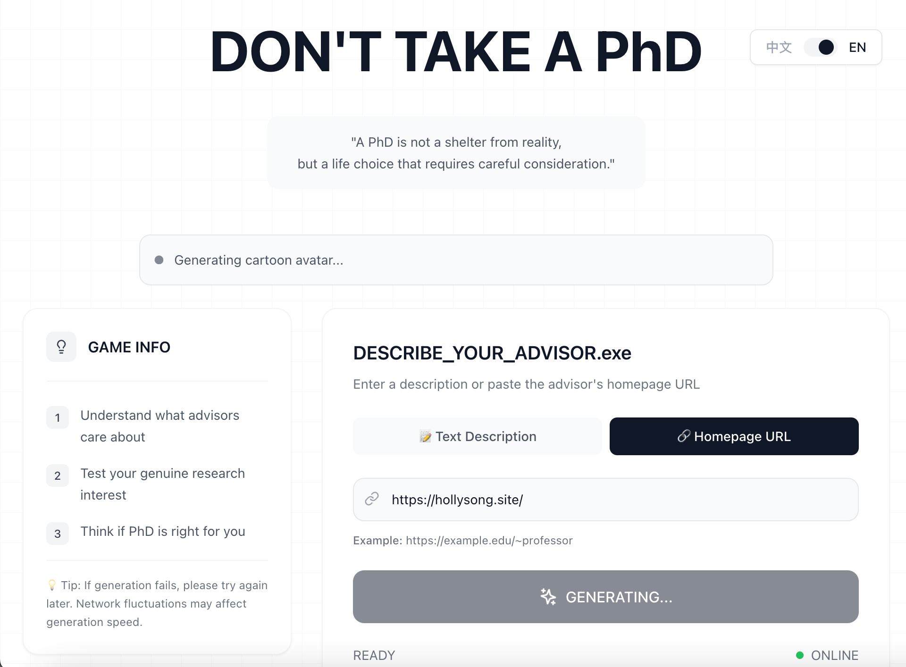
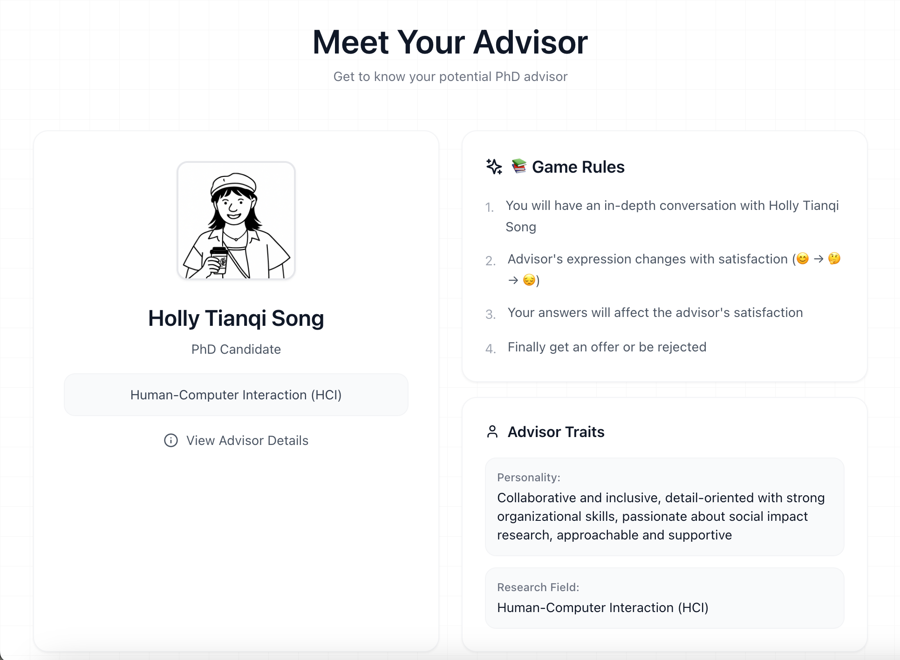
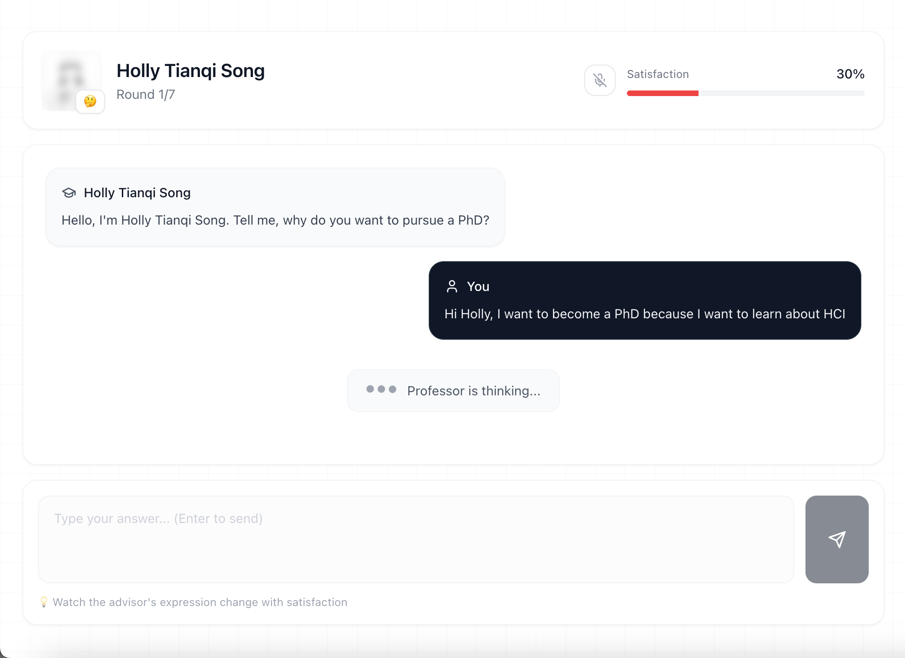
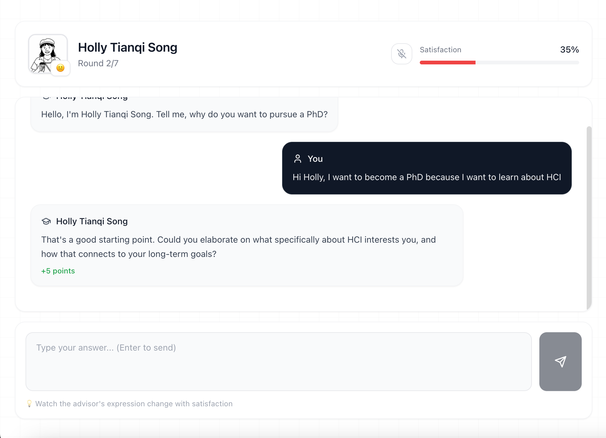
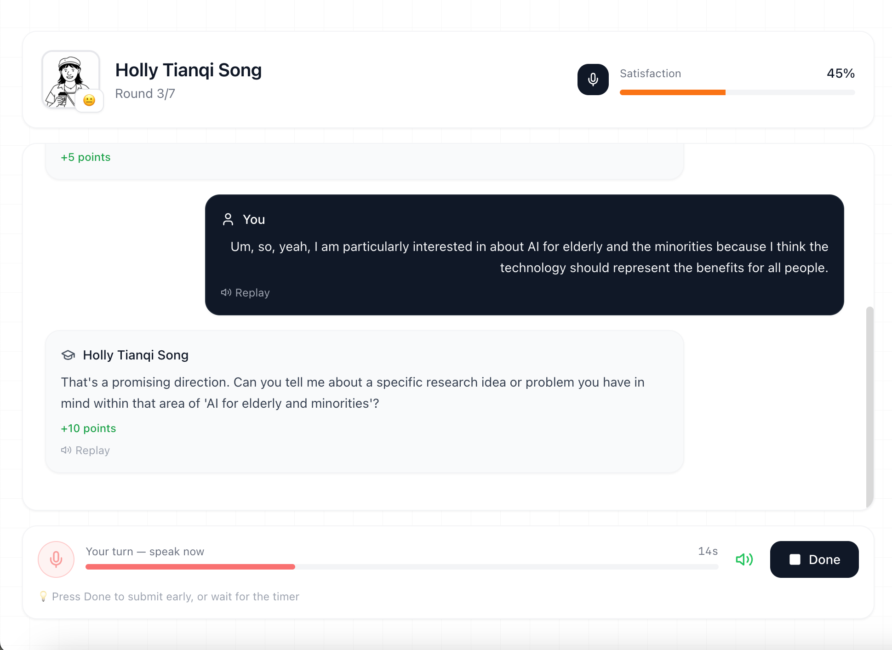
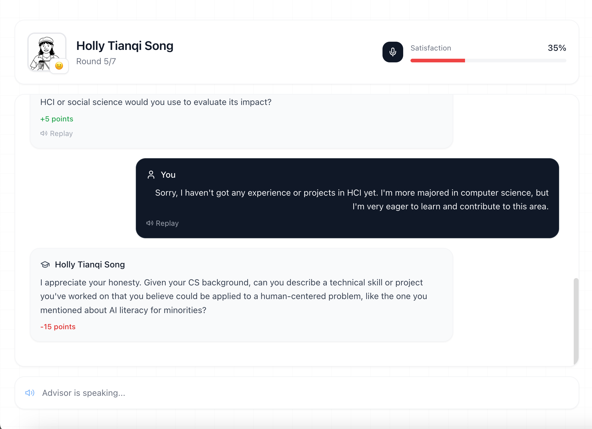
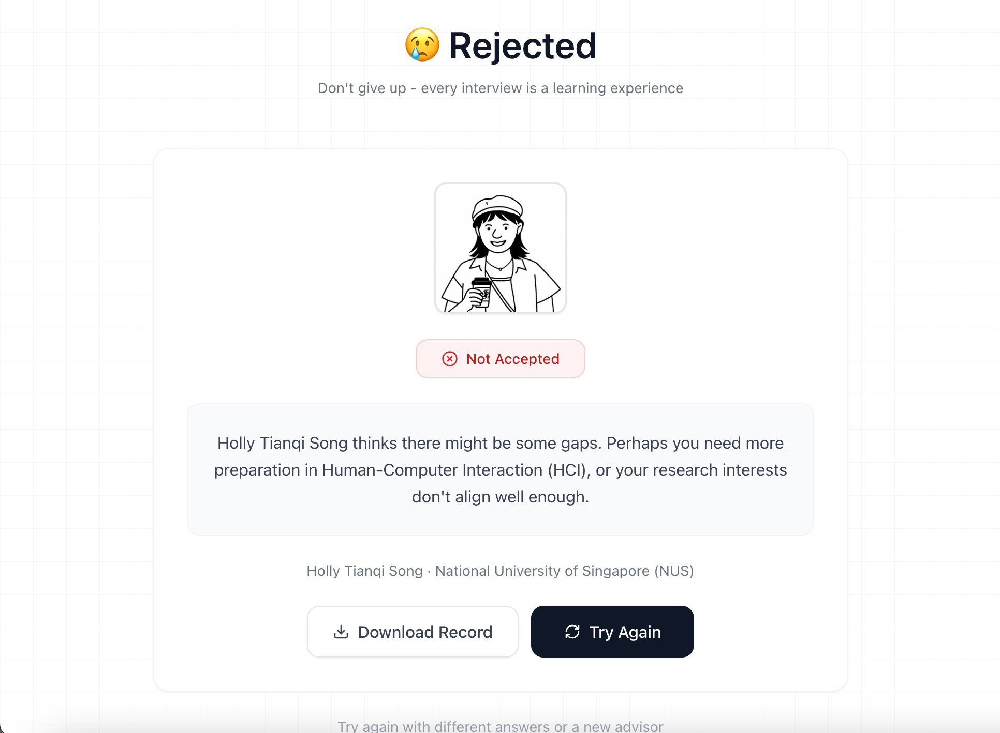
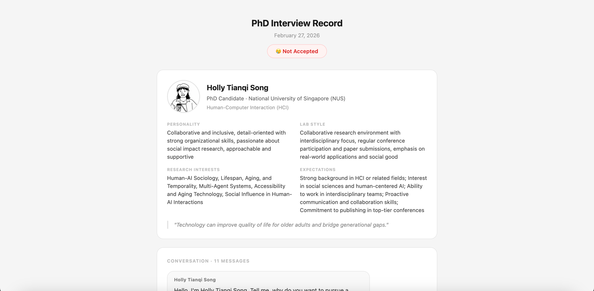
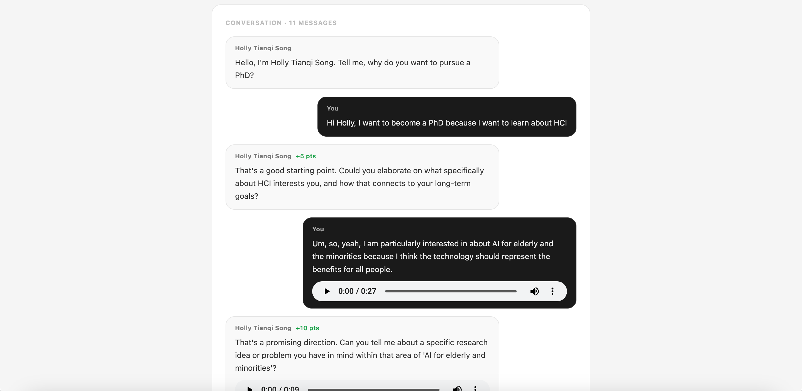

# DON'T TAKE A PhD

> *"A PhD is not a shelter from reality, but a life choice that requires careful consideration."*

A simulation game that lets you practice a PhD advisor interview before committing to one of the biggest decisions of your life. Chat with an AI-powered advisor, see how they react to your answers, and find out if you'd actually get an offer.

**[Play it live →](https://dont-take-phd.vercel.app)**

---

## What You Can Do

- **Generate an advisor from text or a real professor's homepage URL** — describe the advisor you want, or paste a faculty page and let the app extract their profile automatically
- **See a cartoon avatar** generated from the professor's actual photo
- **Have a 7-round scored interview** — your answers affect a live satisfaction meter, and the advisor's expression changes with their mood
- **Use text or voice** — type your answers or speak them out loud; the advisor can speak back too
- **Get a final verdict** — offer or rejection, with a short explanation
- **Download the full record** — save the conversation, scores, and audio as a local file

---

## How It Works

### 1. Describe Your Advisor

Type a description of the kind of advisor you want to interview with — or paste the URL of a real professor's homepage. The app will automatically extract their research interests, personality, and lab style from the page.

---

### 2. Meet Your Advisor

Before the interview starts, you get a full profile of your advisor: their personality, research field, lab style, and what they expect from PhD students. If a photo was found, a cartoon avatar is generated from it.

---

### 3. Have the Conversation (Text Mode)

The interview runs for up to 7 rounds. The advisor asks questions about your research motivation, background, and goals. Type your answers and submit.

---

### 4. Get Instant Feedback

After each answer, the advisor responds and you see the satisfaction score change in real time. Well-thought-out answers earn points; vague or unprepared answers lose them. The advisor's expression changes with their mood.

---

### 5. Switch to Voice Mode

Prefer to practice speaking out loud? Toggle voice mode at any time. Your spoken answers are transcribed automatically, and voice messages can be replayed in the chat.

---

### 6. Hear the Advisor Speak Back

In voice mode, the advisor also speaks their responses aloud. Every message — yours and theirs — gets a replay button so you can review what was said.

---

### 7. Get Your Result

At the end of the interview, you either get an offer or a rejection, along with a short explanation of how the advisor felt about your answers.

---

### 8. Download Your Interview Record

Download a full PDF-style record of the interview — including the advisor's profile, the complete conversation, satisfaction scores per round, and embedded audio players for any voice messages.

---

## Tech Stack

- React + Vite + Tailwind CSS
- OpenAI API (GPT for conversation, TTS/Whisper for voice, gpt-image-1 for avatars)
- Jina Reader for webpage content extraction
- Vercel serverless functions (all API keys stay server-side)
